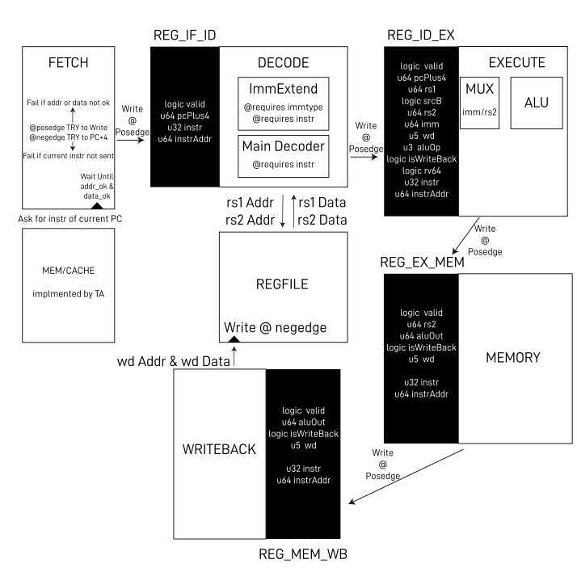
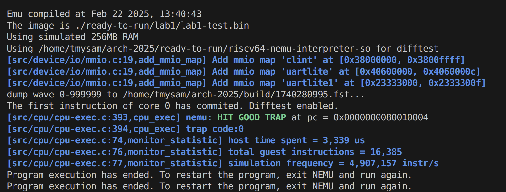

# Lab 1

佟铭洋  
23300240009

## 思路与过程

实际上，一开始不应该直接从代码，或者说各个部分的实现入手，而是应该先解决如何分块，每个部分有什么数据要传递，如何传递的问题。

沿用传统路径，我们仍然将流水线的 5 个部分划分为 Fetch, Decode, Execute, Memory, Writeback。由于本次暂不涉及到数据的读写内存，因此暂时不需要处理 Memory 的部分。由于此次也无任何跳转指令，实际上 PC 就是一直 +4。我们约定每个部分应当以上升沿为信号，将当前部分的处理结果传递给下一部分。也就是说，每个部分的开头都应当有一个寄存器用来存储当前时钟周期内用于本部分计算的内容。

我们先假定不会遇到各种奇怪的问题，先把我们说的流程实现然后再打补丁。

接下来，描述每个部分应该干什么：

### Fetch

处理 PC 自增，以及从内存中读取指令。**注意这个模块未来还要处理跳转指令，此处预留了一些线，但没有使用。**

### Decode

解码指令，将指令的各个部分分离出来，以便后续的执行。

包括：
- 主解码器，用于解码指令的类型，提取出各个部分（寄存器地址），确定 ALU 的操作数，立即数的提取方式，ALU B 输入的来源（寄存器 or 立即数）。
- 立即数扩展器，用于将立即数扩展为 64 位，以便后续的计算。

### Execute

根据 Decode 阶段的结果，进行计算。读取寄存器。注意这一阶段需要执行转发操作，在后面 Tricky Problems 部分会详细说明。

### Memory

暂时不需要实现。直接把需要写入的数据传递给 Writeback 阶段。注意这一阶段需要执行转发操作，在后面 Tricky Problems 部分会详细说明。

### Writeback

将计算结果写回寄存器。（如果这条指令需要写回的话）

## Tricky Problems（本次实验核心部分）

遇到一些问题：

### 访存延迟

第一个问题是访存延迟。由于我们实际上不知道发送给 Cache 模块的地址上的值需要多长时间才能被读取，因此我们需要 Hold PC 的值，直到 Cache 返回数据才能再自增。

那么这时候发送给 Decode 的数据要如何处理呢？实际上非常简单，将 valid 设置为 0 即可。

> 我们规定，对任意模块，输入的寄存器 valid 为 0 时，可以进行读取，但严禁写入，反正读取暂时也没有副作用。

因此，规定 Fetch 模块：

- 在上升沿**尝试**发送当前 PC 以及对应指令的地址。
  - 尝试成功，当且仅当：Cache 返回了当前 PC 的数据。
  - 发送数据后，标记当前 PC 已发送。
- 在下降沿**尝试**自增 PC。
  - 尝试成功，当且仅当：当前 PC 已发送。
  - 自增后，标记当前 PC 未发送。

> 在查阅资料时发现，部分人的实现当中，读取 instr 是在 Decode 阶段进行的，这没有问题，但由于我们读取时间不确定，那么就应该将这个不确定的东西放在流水线的一开头。如果是在 Decode 阶段读取，那么就需要 Decode 拉出一根线来抑制 Fetch 的运行，何必没苦硬吃呢。

### 冒险问题

实际上冒险问题是流水线 CPU 设计的核心问题，这个部分会一直存在，包括 lab2，lab3 都会写到。

由于 lab1 只涉及到运算指令，因此只需要处理数据冒险问题。数据冒险问题是指，当前指令的结果需要用到上一条指令的结果（仅限寄存器），但是上一条指令的结果还没有写回寄存器。这时候就需要进行转发操作。

其实转发比 Bubble 好写一些，且效率更高。因此我们选择转发。

问题的本质是，极端情况下（即每条指令紧挨着，也就是当前周期，如果指令 1 在 Execute 阶段，指令 2 就在 Decode 阶段，指令 3 就在 Fetch 阶段），注意到指令 1 执行到 Writeback 时，指令 2 在 Memory，指令 3 在 Execute，指令 4 在 Decode。假设指令 2、3、4 依赖于指令 1 的结果，那么指令 2、3 都需要转发（4 及以后不需要，已经 Writeback 了）。

也就是说，一条指令在 Execute 时需要将结果转发给正处于 Decode 和 Fetch 阶段的指令。

又遇到一个问题：Fetch 阶段的指令（指令 3）你都不知道他要读哪个寄存器的值，怎么转发呢？

那我们在 Memory 阶段再转发，这时候指令 3 就在 Decode 阶段了，这时候转发就好了。

整个逻辑为：在 Execute 即将结束时，这条指令应该尝试把结果转发给即将完成 Decode 的指令。在 Memory 即将结束时，这条指令应该尝试把结果转发给即将完成 Decode 的指令。

因此，接线时，直接用**组合逻辑**把 Execute 的结果（包括：ALU 结果，是否需要写回，写回地址）传递给 Decode，用**组合逻辑**把 Memory 的结果（包括：是否需要写回，写回地址）传递给 Decode。

在 Decode 完成（即将写入 REG_ID_EX）时，判断当前读取的寄存器地址 rs1，rs2 是否吻合后面 Execute 和 Memory转发回的地址，如果吻合，那么用转发来的数据而不是读取的数据。

> 另外一个小问题是如果 Execute 和 Memory 转发回来的数据都吻合，必须使用 Execute 的数据。因为其比较新。

> 由于本实验的访存延迟固定且较大，实际上不会涉及到冒险问题，没写转发/Bubble 也能过。

### 64 位指令

在 Decoder 里判断一下就好，然后传一个标记到 Execute 阶段，如果是 RV64I，就在 ALU 出来的数据进行截断。

## 实验结果

