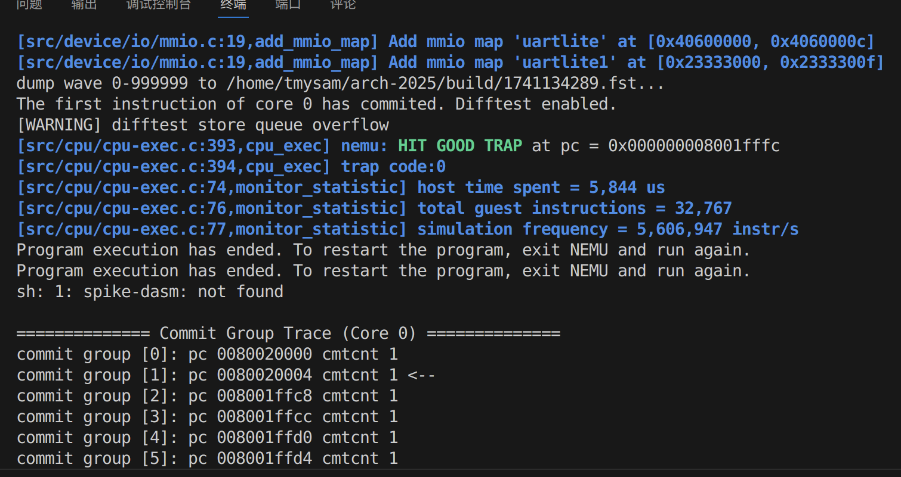

# Lab 2

佟铭洋  
23300240009

## 思路与过程

首先，之前使用了异步的流水线策略，即后面的步骤不会理会前面的步骤如何，只要能执行下去就一直执行。

这种策略在涉及到内存访问时仍然可以继续沿用，但控制信号线会变得比较复杂，因此决定在此次进行修改。将流水线的每个步骤引出一条线，表示当前步骤是否执行完毕，允许下一条指令进入。然后，在顶层（datapath）中，汇总所有模块的信号，当所有模块均执行完毕时，告知所有模块在下一上升沿统一传递寄存器值。

这样，就可以根据不同模块的实际情况决定在何时拉高 ready 信号。对于 fetch 和 memory，这应当发生在访存结束。对于 decode 和 alu，这应当取决于组合逻辑的关键路径长度。对于 writeback，这应当固定为 2 个周期。

然后才正式进入这次实验的内容。我本人将本次实验的内容分为 3 个部分：

- 完成 lui 指令
- 完成 load、store 指令的基本逻辑
- 完成 load 指令对流水线的适配

### 完成 lui 指令

注意到 lui 指令的结果实际上是 立即数+0，另外注意到 auipc 指令的结果是 立即数+pc，考虑到 ALU 的 B 接口已经可以接入立即数，因此重新配置 A，使得其可以接入数字 0、PC，RS1 的其中一个。其余部分（如计算和写回）等同于 I 类型指令。不再赘述。

注意此处为 auipc 指令做了预留。

允许配置 A，使得 A 可以在以下四种输入之间进行 MUX：
- 0
- PC
- PC+4
- RS1

允许配置 B，使得 B 可以在以下两种输入之间进行 MUX：
- 立即数
- RS2

在 decode 阶段，根据指令类型，配置 A 和 B。

```systemverilog
assign ia=moduleIn.srcA==2'b00 ? 64'b0:
            moduleIn.srcA==2'b01 ? moduleIn.rs1:
            moduleIn.srcA==2'b10 ? moduleIn.pc:
            moduleIn.srcA==2'b11 ? moduleIn.pcPlus4:
            0;

assign ib=moduleIn.srcB==2'b00 ? moduleIn.rs2:
            moduleIn.srcB==2'b01 ? moduleIn.imm:
            0;
```

### 完成 load、store 指令

实际上 load、store 指令的访存时序上，没有难度，这与 fetch 阶段获取指令的时序应当保持一致。取回的数据需要暂存，因为只会出现 1 个周期。

重点是处理传给 dbus 的数据以及如何解析返回的数据。

考虑我们对于一条指令，可以知道：
- 读还是写？
- 需要访问的地址？
- 需要访问的长度？
- 立即数扩展模式？

传给 dbus 的参数应当有：
- 写蒙版 strobe
- 地址（8字节对齐）
- 长度

实际上，由于 8 字节对齐的缘故，我们对于 dbus 的参数中的长度，直接固定为 MSIZE8 即可。

另外，需要修改寄存器，使得能够将 rs2 传入 memory 环节。

同理，在返回时移动回低位。

**对于读操作**

strobe 为 0。

在返回的数据中，将对应位置（根据地址的低 3 位确定）的数据（也就是实际上需要的数据）移动到输出的最低位。

```systemverilog
assign data = (memMode == 4'b0000) ? (// lb
                    addressReq[2:0] == 3'b000 ? {{56{dataIn[7]}}, dataIn[7:0]}:
                    addressReq[2:0] == 3'b001 ? {{56{dataIn[15]}}, dataIn[15:8]}:
                    addressReq[2:0] == 3'b010 ? {{56{dataIn[23]}}, dataIn[23:16]}:
                    addressReq[2:0] == 3'b011 ? {{56{dataIn[31]}}, dataIn[31:24]}:
                    addressReq[2:0] == 3'b100 ? {{56{dataIn[39]}}, dataIn[39:32]}:
                    addressReq[2:0] == 3'b101 ? {{56{dataIn[47]}}, dataIn[47:40]}:
                    addressReq[2:0] == 3'b110 ? {{56{dataIn[55]}}, dataIn[55:48]}:
                    addressReq[2:0] == 3'b111 ? {{56{dataIn[63]}}, dataIn[63:56]}:
                    64'b0
                ) ...
```

**对于写操作**

将地址进行 8 字节对齐后，计算原始地址对应的数据应该存放到哪个位置，进行对应的移位。

strobe 在对应的位置设置为 1。

```systemverilog
assign strobe = (memMode == 4'b1000) ? (// sb
                    addressReq[2:0] == 3'b000 ? 8'b00000001:
                    addressReq[2:0] == 3'b001 ? 8'b00000010:
                    addressReq[2:0] == 3'b010 ? 8'b00000100:
                    addressReq[2:0] == 3'b011 ? 8'b00001000:
                    addressReq[2:0] == 3'b100 ? 8'b00010000:
                    addressReq[2:0] == 3'b101 ? 8'b00100000:
                    addressReq[2:0] == 3'b110 ? 8'b01000000:
                    addressReq[2:0] == 3'b111 ? 8'b10000000:
                    8'b0
                ): 
                (memMode == 4'b1001) ? (// sh
                    addressReq[2:0] == 3'b000 ? 8'b00000011:
                    addressReq[2:0] == 3'b010 ? 8'b00001100:
                    addressReq[2:0] == 3'b100 ? 8'b00110000:
                    addressReq[2:0] == 3'b110 ? 8'b11000000:
                    8'b0
                ): 
                (memMode == 4'b1010) ? ( // sw
                    addressReq[2:0] == 3'b000 ? 8'b00001111:
                    addressReq[2:0] == 3'b100 ? 8'b11110000:
                    8'b0
                ):
                (memMode == 4'b1011) ? 8'b11111111: // sd
                0;
```

**模块**

memory_helper：根据指令，处理即将发送给 dbus 的请求。

memory_solver：根据 dbus 返回的数据，处理输出的数据。

### 完成 load 指令对流水线的适配

注意到 store 指令并不会破坏流水线的现有逻辑（其不涉及写回，故不涉及寄存器操作，不影响转发的进行）。只有 load 指令会出现问题：

假设我们的指令仍然是按顺序接续执行的，当 A 指令（load）运行到 memory 阶段时，B 指令运行到 execute 阶段。假设 B 指令依赖于 A 指令写回寄存器，那么无法操作，因为 A 指令要在 memory 才知道取回的数据，B 指令必须要在 decode 阶段知道这一数据，中间必须空出一个 execute （execute空转）来。

```mermaid
timeline
    title Solving Load Hazard
    cycle1: A fetch
    cycle2: A decode
          : B fetch
    cycle3: A execute
          : Bubble
          : B fetch
    cycle4 此时 A  可以转发给 B: A memory
          : Bubble
          : B decode
          : C ...
    cycle5: A writeback
          : Bubble
          : B execute
          : C ...
```

采取一个非常简单粗暴的解决办法：当 decode 模块发现这是一条 load 指令时，直接通知 fetch 模块阻塞一个周期（bubble），相当于插入一个 nop。

需要注意，writeback 和转发时也需要根据指令类型（load）选择采用 ALU 输出还是选择内存输出。

> 另一个问题是：load 指令的 ALU 输出实际上是一个地址而不是写回寄存器的值，这会导致转发出错吗？

答案是不会。因为当 A（一个 Load）执行到 Execute 时，Decode 阶段是一个 Bubble，因此不需要在意。

## 遇到的问题

由于做的比较早，被内存对齐问题坑了一下。

实际上内存访问是 8 字节对齐而非 4 字节。

发现这一问题的过程：

波形图发现出现莫名其妙的不对齐问题，例如高低 4 字节颠倒（这显然不可能是大小端导致的）。

将访问内存的地址的低 2 位和低 3 位分别置 0，发现效果完全一致，注意到这对于一些低位为 `10` 的地址也完全一致，这基本可以确定访问内存是 8 字节对齐了。

先假设是 8 字节对齐，对代码进行修改，发现可以直接通过测试。

## 一些思考

其实本次实验有一个隐含的条件：访存指令的地址均保证 2、4、8 字节对齐（即确保不需要通过总线访问两次内存）。

（以下假设是一个32位处理器，64位地址太长了看着恶心）

考虑这样一个问题：假设需要访问一个 2 字节内存，从 0x80000003 到 0x80000004，由于内存是 4 字节对齐的，因此只能分别取出 0x80000000 到 0x80000003 和 0x80000004 到 0x80000007，然后再进行拼接。这是非常难以接受的，会导致这一条指令有一个超级长的周期才能完成。

好在此次数据没有这样的情况。

## 实验结果

